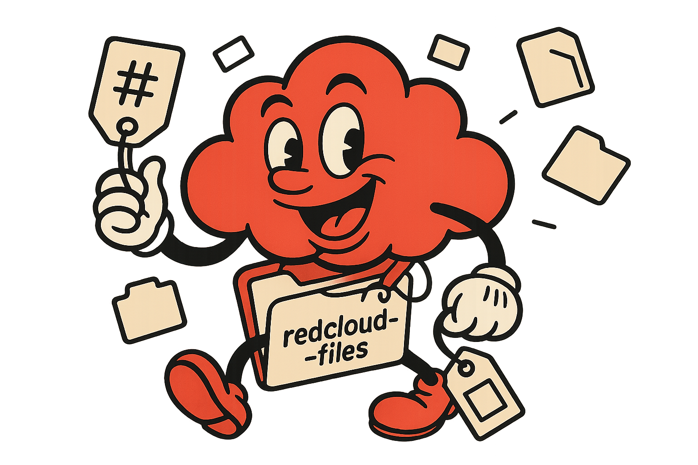

<div align="center">
    
</div>

# RedCloud Files

[](LICENSE)
[](https://go.dev/)

**RedCloud Files** is a tag-based file system implementation in Go that organizes and retrieves files using tags instead of traditional hierarchical folders. This implementation is based on the research paper ["TagFS: A simple tag-based filesystem"](https://web.mit.edu/6.033/2011/wwwdocs/writing-samples/sbezek_dp1.pdf) by Scott Bezek (MIT, 2011).

## Table of Contents

- [Overview](#overview)
- [Features](#features)
- [Architecture](#architecture)
- [Installation](#installation)
- [Quick Start](#quick-start)
- [Usage](#usage)
  - [File Operations](#file-operations)
  - [Tag Operations](#tag-operations)
  - [Device Operations](#device-operations)
  - [Scope Operations](#scope-operations)
  - [Import/Export Operations](#importexport-operations)
- [API Reference](#api-reference)
- [Design & Implementation](#design--implementation)
- [Contributing](#contributing)
- [License](#license)
- [Acknowledgments](#acknowledgments)

## Overview

Traditional file systems organize files in a hierarchical directory structure, which can be limiting when files naturally belong to multiple categories. RedCloud Files solves this problem by using **tags** as the primary organizational mechanism, allowing files to be associated with multiple tags and retrieved through flexible tag-based queries.

The system is designed for academic purposes.

## Features

- **Tag-Based Organization**: Files are organized by tags rather than folders
- **Flexible Querying**: Use scopes to query files by multiple tag combinations
- **Multiple Devices**: Support for multiple logical devices within a single system
- **Efficient B+ Tree Indexing**: Fast tag lookup using B+ tree data structure
- **Persistent Storage**: BadgerDB-backed storage with metadata persistence
- **Import/Export**: Easy file import from and export to the OS filesystem
- **RESTful API**: HTTP API for all file and tag operations
- **Command-Line Interface**: User-friendly CLI for system interaction

## Architecture

RedCloud Files is built with a modular architecture:

```
redcloud-files/
├── cmd/
│   ├── cli/           # Command-line client
│   └── cli-server/    # HTTP API server
├── internal/
│   ├── api/           # API service layer
│   ├── device/        # Device management
│   ├── inode/         # File node management
│   ├── storage/       # Storage abstraction (BadgerDB)
│   ├── tag/
│   │   ├── taglist/   # Tag list with file IDs
│   │   └── tagtree/   # B+ tree for tag indexing
│   ├── scope/         # Scope (query) management
│   └── persistence/   # Metadata serialization
└── pkg/
    └── tagfs/         # Public API interfaces
```

### Core Components

- **Storage Layer**: Fixed-size pages with BadgerDB persistence
- **Inode Manager**: Maps file IDs to data pages and tag lists
- **Tag System**:
  - **Tag List**: Maintains tag metadata and associated file IDs
  - **Tag Tree**: B+ tree for efficient tag name lookup
- **Scope Manager**: Handles complex tag-based queries with caching
- **Device Manager**: Manages multiple logical devices

## Installation

### Prerequisites

- Go 1.22 or higher
- Git

### Build from Source

```bash
# Clone the repository
git clone https://github.com/sekai02/redcloud-files.git
cd redcloud-files

# Install dependencies
go mod download

# Build the server and CLI
go build -o bin/cli-server ./cmd/cli-server
go build -o bin/cli ./cmd/cli
```

## Quick Start

### 1. Start the Server

```bash
./bin/cli-server
```

The server starts on `http://localhost:8080` and creates a default device (ID: 1).

### 2. Create a File

```bash
./bin/cli create --dev 1
# Output: Created file ID: 1
```

### 3. Write Data to the File

```bash
./bin/cli write --dev 1 --file 1 --data "Hello, RedCloud!"
# Output: Wrote 16 bytes
```

### 4. Add Tags to the File

```bash
./bin/cli tag-add --dev 1 --file 1 --tag document
./bin/cli tag-add --dev 1 --file 1 --tag important
# Output: Tag added
```

### 5. Read the File

```bash
./bin/cli read --dev 1 --file 1
# Output: Hello, RedCloud!
```

### 6. Query Files by Tags (Using Scopes)

```bash
# Create a scope
./bin/cli scope-create
# Output: Created scope ID: 2

# Add device 1 as a source
./bin/cli scope-add-source --scope 2 --source 1

# Add tag filters
./bin/cli scope-add-filter --scope 2 --tags document,important

# List files matching the scope
./bin/cli scope-list --scope 2
# Output: Files: [map[device_id:1 file_id:1]]
```

## Usage

### File Operations

#### Create a File

```bash
./bin/cli create --dev <device_id>
```

Creates a new empty file on the specified device.

**Example:**
```bash
./bin/cli create --dev 1
# Output: Created file ID: 3
```

#### Write Data to a File

```bash
./bin/cli write --dev <device_id> --file <file_id> --data "<content>" [--off <offset>]
```

Writes data to a file at the specified offset (default: 0).

**Example:**
```bash
./bin/cli write --dev 1 --file 3 --data "This is my file content"
# Output: Wrote 23 bytes
```

#### Read Data from a File

```bash
./bin/cli read --dev <device_id> --file <file_id> [--off <offset>] [--len <length>]
```

Reads data from a file starting at the specified offset.

**Example:**
```bash
./bin/cli read --dev 1 --file 3
# Output: This is my file content

./bin/cli read --dev 1 --file 3 --off 5 --len 10
# Output: is my file
```

#### Copy a File

```bash
./bin/cli copy --dev <device_id> --file <file_id> --dst <dest_device_id>
```

Copies a file and all its tags to another device.

**Example:**
```bash
./bin/cli copy --dev 1 --file 3 --dst 1
# Output: Copied to file ID: 4
```

#### Delete a File

```bash
./bin/cli delete --dev <device_id> --file <file_id>
```

Deletes a file and removes it from all associated tags.

**Example:**
```bash
./bin/cli delete --dev 1 --file 3
# Output: File deleted
```

### Tag Operations

#### Add a Tag to a File

```bash
./bin/cli tag-add --dev <device_id> --file <file_id> --tag <tag_name>
```

Associates a tag with a file. If the tag doesn't exist, it's created automatically.

**Example:**
```bash
./bin/cli tag-add --dev 1 --file 1 --tag project
./bin/cli tag-add --dev 1 --file 1 --tag 2024
# Output: Tag added
```

#### Remove a Tag from a File

```bash
./bin/cli tag-remove --dev <device_id> --file <file_id> --tag <tag_name>
```

Removes a tag association from a file.

**Example:**
```bash
./bin/cli tag-remove --dev 1 --file 1 --tag 2024
# Output: Tag removed
```

#### List All Tags for a File

```bash
./bin/cli tag-list --dev <device_id> --file <file_id>
```

Shows all tags associated with a file.

**Example:**
```bash
./bin/cli tag-list --dev 1 --file 1
# Output: Tags: [project document important]
```

### Device Operations

#### List All Devices

```bash
./bin/cli devices
```

Lists all available devices in the system.

**Example:**
```bash
./bin/cli devices
# Output: Devices: [1]
```

### Scope Operations

Scopes allow you to query files based on tag combinations. A scope can have multiple sources (devices or other scopes) and multiple tag filters.

#### Create a Scope

```bash
./bin/cli scope-create
```

Creates a new empty scope.

**Example:**
```bash
./bin/cli scope-create
# Output: Created scope ID: 5
```

#### Add a Source to a Scope

```bash
./bin/cli scope-add-source --scope <scope_id> --source <source_id>
```

Adds a device (or another scope) as a source for the scope. The source ID can be a device ID or another scope ID.

**Example:**
```bash
./bin/cli scope-add-source --scope 5 --source 1
# Output: Source added
```

#### Add Tag Filters to a Scope

```bash
./bin/cli scope-add-filter --scope <scope_id> --tags <tag1,tag2,...>
```

Adds tag filters to a scope. Files must have ALL specified tags to match (AND operation).

**Example:**
```bash
./bin/cli scope-add-filter --scope 5 --tags document,important
# Output: Filters added
```

#### List Files Matching a Scope

```bash
./bin/cli scope-list --scope <scope_id>
```

Retrieves all files that match the scope's criteria.

**Example:**
```bash
./bin/cli scope-list --scope 5
# Output: Files: [map[device_id:1 file_id:1] map[device_id:1 file_id:2]]
```

### Import/Export Operations

#### Import a File from OS Filesystem

```bash
./bin/cli import --dev <device_id> --path <os_file_path> [--tags <tag1,tag2,...>]
```

Imports a file from the OS filesystem into RedCloud Files with optional tags.

**Example:**
```bash
./bin/cli import --dev 1 --path /tmp/document.txt --tags document,backup,2024
# Output: Imported file 'document.txt' with ID: 6
```

#### Export a File to OS Filesystem

```bash
./bin/cli export --dev <device_id> --file <file_id> --path <os_file_path>
```

Exports a RedCloud file to the OS filesystem.

**Example:**
```bash
./bin/cli export --dev 1 --file 6 --path /tmp/exported_document.txt
# Output: Exported file to: /tmp/exported_document.txt
```

## API Reference

The server exposes a RESTful HTTP API on port 8080.

### File API

| Method | Endpoint | Description |
|--------|----------|-------------|
| `POST` | `/v1/files` | Create a new file |
| `GET` | `/v1/files/{dev}/{fid}?off={offset}&len={length}` | Read file data |
| `PUT` | `/v1/files/{dev}/{fid}?off={offset}` | Write file data |
| `DELETE` | `/v1/files/{dev}/{fid}` | Delete a file |
| `POST` | `/v1/files/{dev}/{fid}/copy?dst={dst_dev}` | Copy a file |

### Tag API

| Method | Endpoint | Description |
|--------|----------|-------------|
| `POST` | `/v1/tags/{dev}/{fid}` | Add a tag (body: `{"name": "tag"}`) |
| `DELETE` | `/v1/tags/{dev}/{fid}?name={tag}` | Remove a tag |
| `GET` | `/v1/tags/{dev}/{fid}` | List all tags for a file |

### Device API

| Method | Endpoint | Description |
|--------|----------|-------------|
| `GET` | `/v1/devices` | List all devices |

### Scope API

| Method | Endpoint | Description |
|--------|----------|-------------|
| `POST` | `/v1/scopes` | Create a new scope |
| `POST` | `/v1/scopes/{sid}/sources` | Add a source (body: `{"source_id": 1}`) |
| `DELETE` | `/v1/scopes/{sid}/sources` | Remove a source |
| `POST` | `/v1/scopes/{sid}/filters` | Add tag filters (body: `{"tags": ["tag1"]}`) |
| `DELETE` | `/v1/scopes/{sid}/filters` | Remove tag filters |
| `GET` | `/v1/scopes/{sid}/list` | List files matching the scope |

### Import/Export API

| Method | Endpoint | Description |
|--------|----------|-------------|
| `POST` | `/v1/import` | Import file from OS (body: `{"device_id": 1, "path": "/tmp/file", "tags": []}`) |
| `POST` | `/v1/export/{dev}/{fid}` | Export file to OS (body: `{"path": "/tmp/output"}`) |

## Design & Implementation

RedCloud Files follows the design principles outlined in Scott Bezek's research paper with the following key implementation details:

### Tag Storage

- **Tag List**: Each tag maintains a list of file IDs (with inline storage and overflow handling)
- **Tag Tree**: B+ tree provides O(log n) tag name lookup
- **Tag IDs**: Unique 64-bit identifiers allocated via bitmap

### File Storage

- **Pages**: Fixed-size pages (4 KiB default) stored in BadgerDB
- **Inodes**: Map file IDs to data pages and maintain tag ID lists
- **Growth**: Files automatically grow by allocating new pages as needed

### Scope System

Scopes provide powerful querying capabilities:

1. **Device Sources**: Query files on specific devices filtered by tags (AND operation)
2. **Scope Sources**: Compose scopes hierarchically (OR operation)
3. **Caching**: Results are cached and invalidated incrementally on tag changes
4. **Cycle Prevention**: Detects and prevents circular scope references

### Persistence

- **Metadata**: Tag tree, tag list, and inode mappings are persisted to BadgerDB
- **Data**: File contents stored as fixed-size pages in BadgerDB
- **Graceful Shutdown**: Metadata is saved on server shutdown

## Contributing

Contributions are welcome! This is an academic project, but improvements and bug fixes are appreciated.

1. Fork the repository
2. Create a feature branch (`git checkout -b feature/amazing-feature`)
3. Commit your changes (`git commit -m 'Add amazing feature'`)
4. Push to the branch (`git push origin feature/amazing-feature`)
5. Open a Pull Request

## License

This project is licensed under the MIT License - see the [LICENSE](LICENSE) file for details.edcloud-files

## Acknowledgments

This implementation is based on the research paper:

**"TagFS: A simple tag-based filesystem"**
Scott Bezek, MIT, 2011
[https://web.mit.edu/6.033/2011/wwwdocs/writing-samples/sbezek_dp1.pdf](https://web.mit.edu/6.033/2011/wwwdocs/writing-samples/sbezek_dp1.pdf)

The paper presents a novel approach to file organization using tags instead of hierarchical directories, and this project aims to bring those concepts to life in a working implementation.

---

**Note**: This is an academic project developed for educational purposes. While initially centralized, the system is designed with future distributed capabilities in mind.
